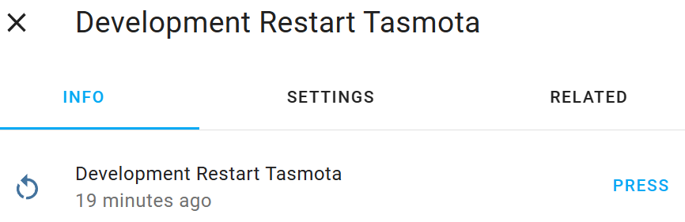
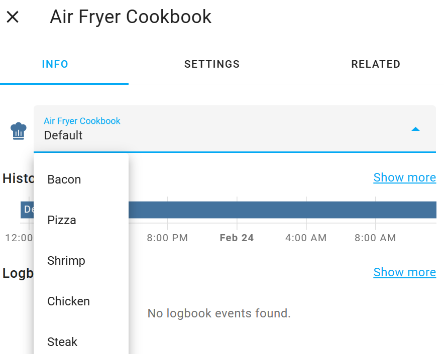

# Home Assistant Controls for Tasmota

This is a Tasmota Berry Script library (so requires Tasmota32) to greatly simplify the process of exposing Home
Assistant controls (e.g. Pull-down Lists, Number Sliders, Sensors, etc.) from a Tasmota device - and handling the
communication between both sides.

Using `hct` to expose, for example, a "Restart Tasmota" button to Home Assistant is as simple as adding the
following line to your `autoexec.be`:

```be
hct.Button(        
    'Restart Tasmota',
    nil,
    'mdi:restart',
    hct.CallbackIn(/value->tasmota.cmd("restart 1"))
)
```

A fully functional restart button will now appear associated with the device in Home Assistant:



Or, more practically, a cookbook pull-down menu, for a Tuya air fryer, might look like this:

```be
food_data=hct.MapData({'Default':0, 'Fries':1,'Shrimp':2,'Pizza':3,'Chicken':4,'Fish':5,'Steak':6,'Cake':7,'Bacon':8,'Preheat':9,'Custom':10})

hct.Select(   
    'Cookbook',
    food_data.keys,
    nil,
    'mdi:chef-hat',
    [
        hct.CallbackOut(
            'tuyareceived#dptype4id3',
            /value->food_data.out.find(value,'Default')
        ),
        hct.CallbackIn(
            /value->hct.tuya_send(4,3,food_data.in.find(value,0))
    )
    ]
)
```



For a full walk-through of configuring the cookbook entity, see the [Walkthrough Example](#example-walkthrough) below.

## Do I Need This? Can't I Do this with Native Tasmota?

You certainly can.

But in my experience, the process is so fiddly, error-prone and hard to maintain that it's enough to
deter the casual user (as I am) entirely. Plus, sharing your configuration, once you've finally got it working, can mean
complex step-by-step guides, setting up triggers, finding MAC addresses and topics (in Tasmota) - and numerous
Blueprints, Helpers and Templates (on the Home Assistant side).

You can see how much work creating such guides involves by seeing how it
was [heroically undertaken by Blakadder](https://blakadder.com/proscenic-in-home-assistant/), as
compared with the [full `hct`-based equivalent](/examples/proscenic_t21.be).

With `hct`, on the other hand, the thorny parts of the initial setup are abstracted away and your final configuration
can often be shared via a one-liner, or failing that a single script. Below is a list of some of the tasks that `hct`
handles for you:

* Announcing the entity via MQTT to Home Assistant
* Generating MQTT/HA-friendly unique IDs
* Associating the entity with its parent device
* Subscribing and publishing to the relevant MQTT topics
* Managing the relevant Tasmota rules
* Appropriate serialization of data
* Translating Home Assistant messages to their to appropriate Berry data types, and vice versa


## Pre-Release

:warning: This library is currently in a pre-release state. The configuration format (and perhaps even the library name)
is likely to change, and only `Sensor`, `Select`, `Button`, `Number`, `BinarySensor`, `Switch`, `Text`, `Update`, `Fan`
and `Climate` entities are currently implemented.

## Installing

Simply paste the following into your Tasmota Berry Script Console:

```be
tasmota.urlfetch('https://raw.githubusercontent.com/fmtr/hct/release/hct.tapp','/hct.tapp')
```

:warning: You will then *need to restart your device* before use.

You should then see `HCT: Successfully imported Home Assistant Controls for Tasmota (hct)...` in
your start-up logs. This means `hct` has been added to your global scope, so you don't need to `import` it.

## Example Walkthrough

This walk-through is a real-world case of implementing the cookbook pull-down menu for a Proscenic T21 air fryer. It
handles defining a friendly pull-down list of food types on the Home Assistant side and mapping those values to the
corresponding IDs required by the Tuya driver on the Tasmota side.

First, we specify the options to show in our pull-down. We can use a `MapData` object, which will create
incoming/outgoing
(i.e. incoming from Home Assistant, outgoing from Tasmota) mappings for use in any callbacks we write. So this is a
mapping from strings to integers.

```be
food_data=hct.MapData({'Default':0, 'Fries':1,'Shrimp':2,'Pizza':3,'Chicken':4,'Fish':5,'Steak':6,'Cake':7,'Bacon':8,'Preheat':9,'Custom':10})
```

Then we write a very simple callback closure to set those Tuya IDs (the `value` argument) on the Tasmota side, when
their names are selected in Home Assistant. This again uses an `hct` utility function, `tuya_send`, to send the value.

```be   
set_cookbook_entry=/value->hct.tuya_send(4,3,food_data.in.find(value,0))
```

Now we specify a trigger, for when a change has happened on the Tasmota side (e.g. a button pressed on the air fryer),
along with a callback to handle that trigger.
The output of the callback will be reflected in Home Assistant, so we just translate the Tuya ID back the "friendly"
name HA uses.

```be
trigger='tuyareceived#dptype4id3'
report_cookbook_entry=/value->food_data.out.find(value,'Default')
```

With that done, we need to wrap our callback functions in `CallbackIn`/`CallbackOut` objects, which tell `hct` which
direction (In or Out) each callback is intended for, associate the trigger with the outgoing callback, etc.

```be
callbacks=[
    hct.CallbackIn(set_cookbook_entry),
    hct.CallbackOut(trigger,report_cookbook_entry)    
]
```

With that all done, we can define a pull-down (`hct.Select`) object.

```be
hct.Select(   
    'Cookbook',         # Name
    food_data.keys,     # List of values (i.e. the strings from our `MapData` object)
    nil,                # Entity ID (we can leave `nil` to let Home Assistant decide
    'mdi:chef-hat',     # Icon ID
    callbacks           # Our list of callbacks we defined above.
) 
```

And that's it. The new Select control will appear in Home Assistant, associated with the air fryer device. In other
words, `hct` will handle everything else mentioned above - and sharing what you've done just means sharing
the above script.

For the rest of the air fryer setup (which includes defining more entity types)
see [its setup script](examples/proscenic_t21.be) - and further examples can be found in the [examples](examples/)
directory.